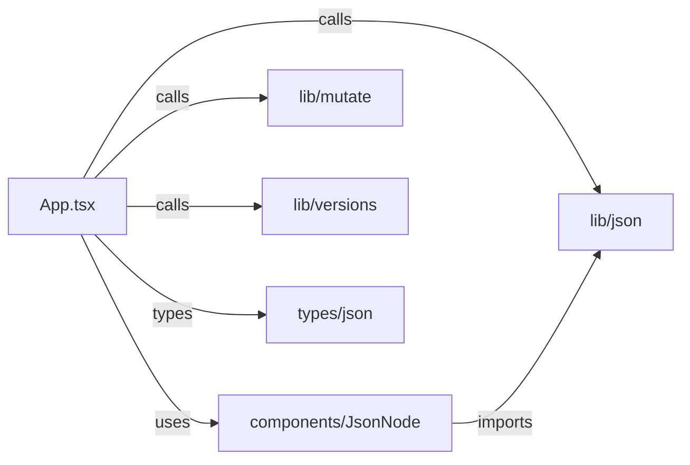

# 项目架构

## 技术栈
- React 19 + TypeScript
- Vite 构建
- Tailwind CSS（PostCSS 集成）
- Vitest 单元测试

## 目录结构
```text
src/
  components/
    JsonNode.tsx
  lib/
    json.ts        # 解析与类型工具
    mutate.ts      # 数据路径变更算法
    versions.ts    # 版本栈与撤回逻辑
  types/
    json.ts        # JSON 类型模型
  App.tsx          # 页面编排与状态
  main.tsx
```

## 架构图（Mermaid）


## 数据流
- 输入区与字符串区互相同步，解析为 `JSONValue`
- 可视化树点击/删除/更新通过 `applyMutation` 生成新数据，并回写编辑区
- 大改动触发 `versions.push`，撤回走 `versions.undo`
